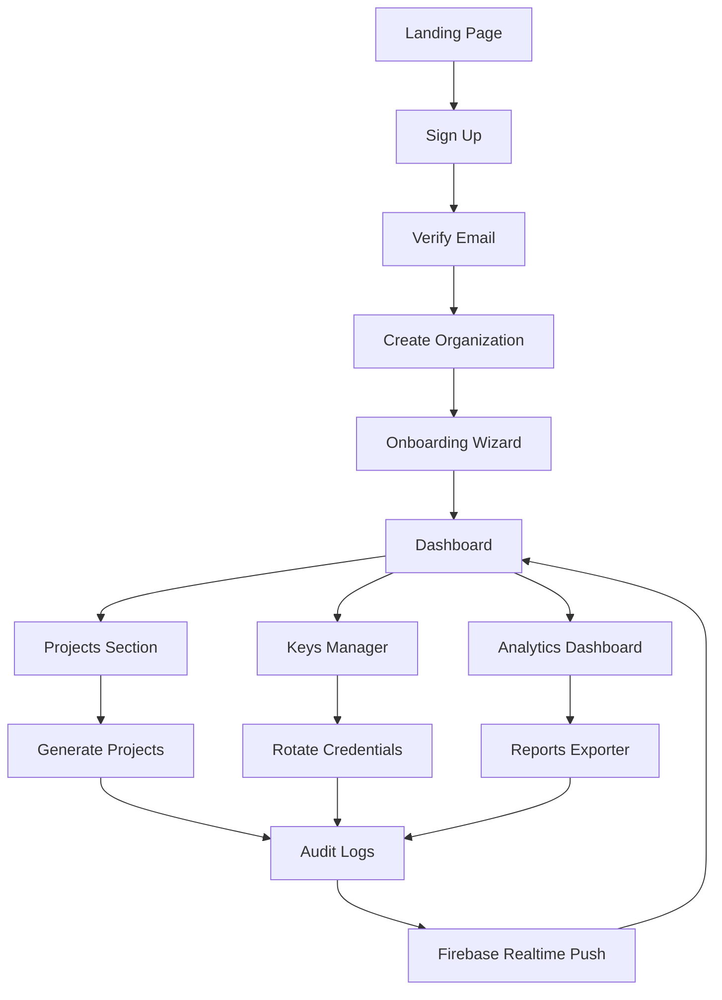
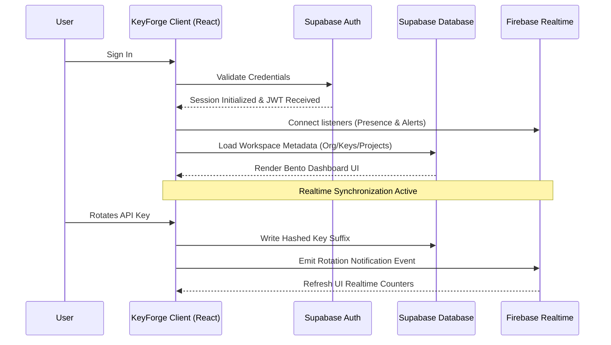

# KeyForge SaaS Application Workflow & Architecture Guide

Welcome to the official system workflow and architecture documentation for **KeyForge**. This document describes the user lifecycle, real-time database synchronizations, security safeguards, and details every option across the KeyForge SaaS platform.

---

## 🗺️ 1. Complete User Journey Map



---

## 🔑 2. Application Lifecycle



---

## 🚪 3. Detailed Workflow Modules

### 🌐 3.1. Landing & Authentication
- **Landing Page (Entry Point)**: Displays KeyForge product value, pricing matrix, Hash-on-Write cryptographic security claims, customer testimonials, and quick Call-to-Action (CTA) triggers.
- **Actions Available**:
  - **Sign Up / Sign In**: Accesses the Auth client portal.
  - **View Documentation**: Developer resources.
  - **Pricing**: SaaS tiers and API usage scales.
  - **Contact Support**: Reaches support team.

- **Authentication System**: Powered by **Supabase Auth** for secure JWT session tokens. **Firebase** is dynamically initialized immediately after successful authentication to set up real-time websocket subscriptions.

---

### 🚀 3.2. Organization Setup (Onboarding Wizard)
First-time users are guided through a structured workspace setup flow:
1. **Create Organization**:
   - Fields: *Organization Name*, *Organization Slug*, *Industry*, *Region*.
   - Saves directly to the core workspace database (Supabase).
2. **Create First Project**:
   - Fields: *Project Name*, *Environment* (`Development`, `Staging`, `Production`).
3. **Generate First API Key**:
   - Fields: *Key Label*, *Permission Scope*, *Expiration*, *Description*.
   - Uses **Hash-on-Write** (saves only salted SHA-256 hashes of private secrets).
4. **Invite Team**:
   - Fields: *Collaborator Name*, *Email*, *Assign Role* (`Admin`, `Developer`, `Viewer`).
5. **Setup Completion**: Redirects session context to the central dashboard.

---

### 📊 3.3. Dashboard Workflow
The primary workspace control center:
- **Metrics Tracked**: Active Keys counter, Total Projects, Total Requests, Average Latency, Active Alerts, and Recent Activity feed.
- **Sync Architecture**: Persistent historical metadata loads from **Supabase**; live widgets update instantly through **Firebase Realtime Database** event streams.
- **Navigation Controls**:
  - Click **Active Keys** $\rightarrow$ Navigate to Key Manager
  - Click **Projects** $\rightarrow$ Navigate to Projects Page
  - Click **Analytics** $\rightarrow$ Navigate to Analytics Dashboard
  - Click **Reports** $\rightarrow$ Navigate to Reports
  - Click **Alerts** $\rightarrow$ Navigate to Security Alerts

---

### 📂 3.4. Project Management
Projects act as security and resource isolation boundary groups:
- **Card click**: Opens the detailed **Project Details** screen containing custom metric charts, a dedicated keys list, assigned team lists, and a danger zone.
- **Workflow**:
  `Create Project` $\rightarrow$ `Configure Environment` $\rightarrow$ `Generate Keys` $\rightarrow$ `Assign Team` $\rightarrow$ `Project Active`.
- Stored and managed inside **Supabase**.

---

### 🔑 3.5. Key Management (Credentials Lifecycle)
- **Generation Flow**:
  `Create Key` $\rightarrow$ `Assign Project` $\rightarrow$ `Assign Scopes` $\rightarrow$ `Set Expiration` $\rightarrow$ `Display Secret Once` $\rightarrow$ `Copy`.
- **Runtime Controls**:
  - **Reveal**: Temporarily exposes the unmasked token in client-side memory.
  - **Rotate**: Deactivates the old token, runs a loading spinner, and replaces it with a new hashed value.
  - **Enable / Disable / Delete**: Toggle key activity states dynamically.
  - **Export CSV**: Secure download of credential definitions.
- **Security Audit Loop**:
  `Any Key Mutation` $\rightarrow$ `Write immutable Audit Log` $\rightarrow$ `Trigger Firebase push` $\rightarrow$ `Refresh UI widgets`.

---

### 📈 3.6. Analytics & Reports
- **Analytics**: Choose range metrics (`7D`, `30D`, `90D`) and select a Project to view:
  - **Request Volume**: Trend lines.
  - **Peak Usage**: Hour-by-hour heatmap blocks.
  - **Error Rate**: Status donut tracker (`200 OK`, `4xx`, `5xx`).
  - **Response Time**: Calibrated gauge needle matching optimal latency boundaries.
- **Reports**: Select reporting scopes (**Weekly**, **Monthly**, **Quarterly**) to export localized CSV data.

---

### 🚨 3.7. Alerts & Incident Investigation
- **Trigger Sequence**:
  `Key Expiries / Security Anomalies` $\rightarrow$ `Firebase Event` $\rightarrow$ `Trigger Alert Card` $\rightarrow$ `Dashboard Pulse Indicator`.
- **Mitigation Triggers**:
  - **Rotate Key**: Deauthorizes flagged tokens and issues new ones.
  - **Investigate**: Redirects to Analytics logs.
  - **Dismiss**: Clears alerts from the feed.

---

### 👥 3.8. Team Management
Workspace roles control access to organization projects:
- **Invitation Loop**:
  `Invite Member` $\rightarrow$ `Email Dispatch` $\rightarrow$ `Verify Token` $\rightarrow$ `Member Joins Organization` $\rightarrow$ `Access Granted`.
- **Roles**:
  - **Owner**: Full workspace management and billing control.
  - **Admin**: Create projects, manage keys, invite users.
  - **Developer**: Create keys, view analytics, manage assigned projects.
  - **Viewer**: Read-only access to metrics.

---

### ⚙️ 3.9. Settings & Customization
System settings scroll to matching target sections on click:
- **Account / Security**: Edit organization parameters, configure MFA, and toggle new session email alerts.
- **Integrations / Webhooks**: Configure endpoint targets for key rotation webhooks.
- **Appearance**: Toggle theme selectors (Dark/Light mode) or disable animations (**Reduce Motion**).
- **Danger Zone**: Triggers confirmation dialogs to revoke all active keys or delete the account.

---

## 🔔 4. Realtime Notification Flow (Firebase)
```
System Event (e.g. key rotated)
       │
       ▼
Firebase Cloud Function (Triggers on write)
       │
       ▼
Firestore Notification Document created
       │
       ▼
Realtime WebSocket push to active client
       │
       ▼
Header Notification Bell icon animates and displays badge
```

---

## 📝 5. Immutable Audit System (Supabase)
Every critical action creates a read-only audit log:
- **Logged Events**: logins, logouts, project creations, key generations, key rotations, deletions, member invitations, and settings changes.
- **Security Rule**: Audit Logs are stored in a read-only schema. Row-level updates or deletes are disabled via database triggers.

---

## 💾 6. Database Responsibilities Breakdown

| 🗄️ Supabase (System of Record) | 🔥 Firebase (Realtime Layer) |
| :--- | :--- |
| User Authentication & Sessions | Realtime Alerts & Push Notifications |
| Organization Metadata & Slug | Live Dashboard Statistics |
| Projects & Keys Metadata | Active Presence Indicators |
| Team Members & RBAC Settings | Live Activity Feed & Audit Streams |
| Immutable Audit Log Entries | Realtime Counters (Request Volume) |
| Billing, Subscriptions, & settings | Temporary Cached Traffic States |
| Webhook Target Configurations | Web Socket Subscriptions |
